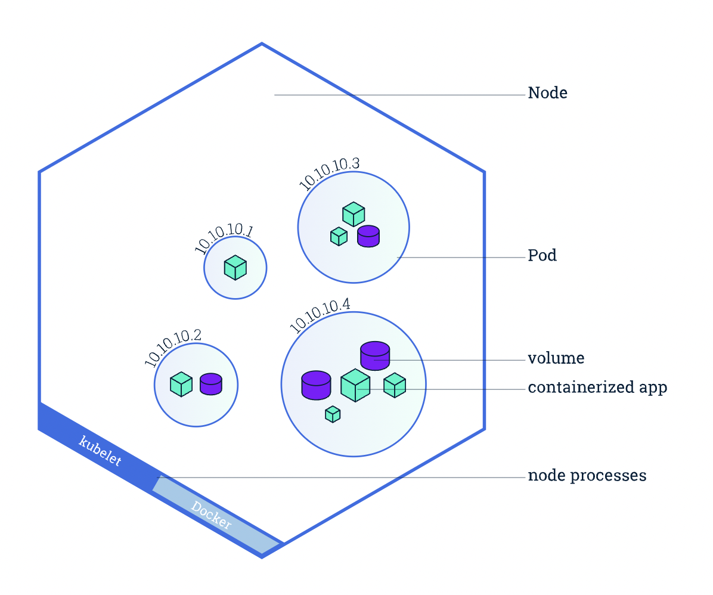
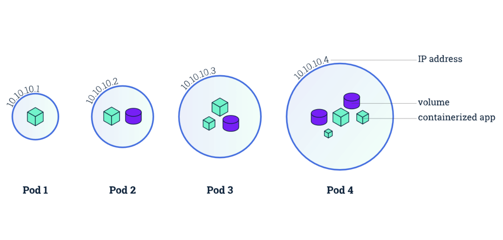

# Kubernetes Intro

## Why is kubernetes required?

With docker-compose, we don't have much control over scalling individual containers as desired.  
Supposing in our `complex` app, we want to scale only `worker` service as per network requests since it's the one doing most of the heavy-lifting, we want to be able to make different copies of it only, and no other service.  
With docker-compose, we have the option to get all services copied but with kubernetes we have more control to get to a desired state with our services.  

## What does Kubernetes do?
Kubernetes runs a node with multiple pods.

## What is a Node?

> https://kubernetes.io/docs/tutorials/kubernetes-basics/explore/explore-intro/

Nodes are worker machines in k8s which might be a virtual machine or an actual machine.

## What is a Pod?

> https://ngugijoan.medium.com/understanding-pods-kubernetes-8fe3717046d4

Pods are units in k8s that run one or more similar purpose containers. Usually we run one container in each pod, unless multiple containers are very tightly coupled and need to run together in the same pod.  
Pod is a collection of containers that can run on a host. This resource is created by clients and scheduled onto hosts.

## What is Deployment

## Commands

1. Getting Objects

   * Get Pods  
   `kubectl get pods`  
   `kubectl get pods -o wide` for more options
   
   * Get Services  
   `kubectl get services`  

2. Creating Objects

    * We need to create a yaml file for each type of object having its own syntax.
    
    * Then we can apply these files using  
    `kubectl apply -f <file-name>`  

3. Getting details description

    `kubectl describe pods <pod-id>`  
    `kubectl describe services <service-id>`

4. Deleting objects

    `kubectl delete -f <file-name>`

5. Exec into pods

    `kubectl exec -it <pod-id> sh`  

6. Getting logs from pod

    `kubectl logs <pod-id>`  
    `kubectl logs -f <pod-id>` will get live logs

7. Updating Image for deployment

    ```
    kubectl set image <object-type>/<object-name> <container-name>=<image-name-with-tag>
    
    kubectl set image deployments/api-deployment api-deployment=<image-name-with-tag>
    ```  